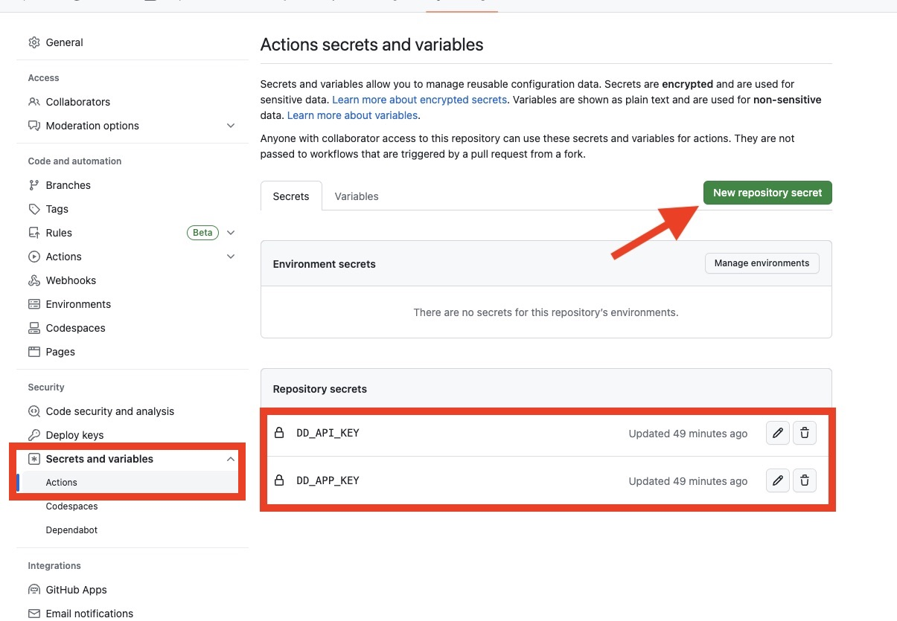

# rosie-github-action

## Preliminary

You should use the Datadog static analyzer. Your repository should have
a `static-analysis.datadog.yml` file that specifies what rule to use.


## Use the action

Create a file in `.github/workflows` to configure your GitHub action.

Example of configuration

```yaml

on: [push]

jobs:
  datadog-static-analysis:
    runs-on: ubuntu-latest
    name: Datadog Static Analyzer
    steps:
    - name: Checkout
      uses: actions/checkout@v2
    - name: Check code meets quality standards
      id: datadog-static-analysis
      uses: juli1/rosie-github-action@main
      with:
        dd_app_key: ${{ secrets.DD_APP_KEY }}
        dd_api_key: ${{ secrets.DD_API_KEY }}
        dd_env: "My Environment"
        dd_service: "My Service"
        dd_site: "datadoghq.com"
```

See [the following file](https://github.com/juli1/rosie-tests/blob/main/.github/workflows/datadog-static-analysis.yml) for an example.


## API and Application Key

We highly recommend you set your API and application key as a GitHub secret.

To do so, follow these steps:

1. Go to your repository settings
2. Go in `Secrets and Variables`
3. Add the `DD_API_KEY` and `DD_APP_KEY` secrets

See the screenshot below for reference.


